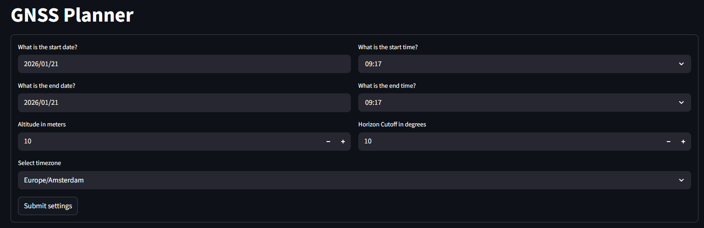
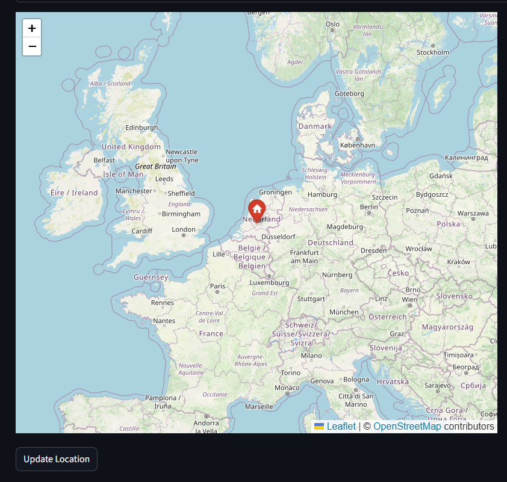
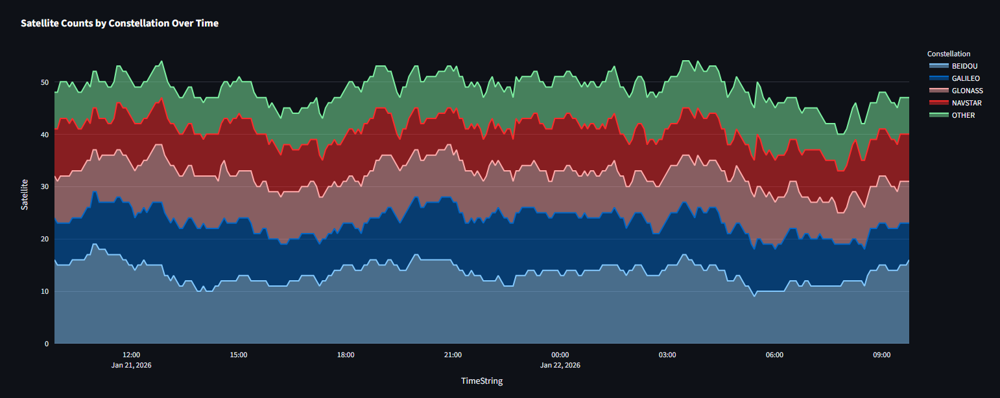
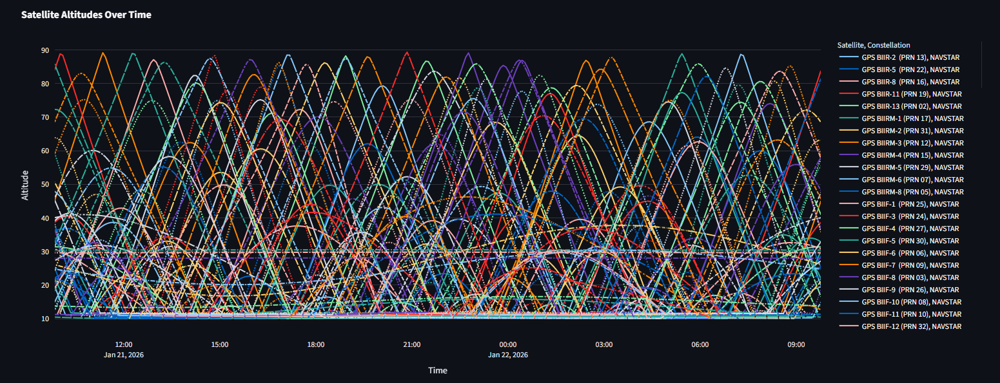
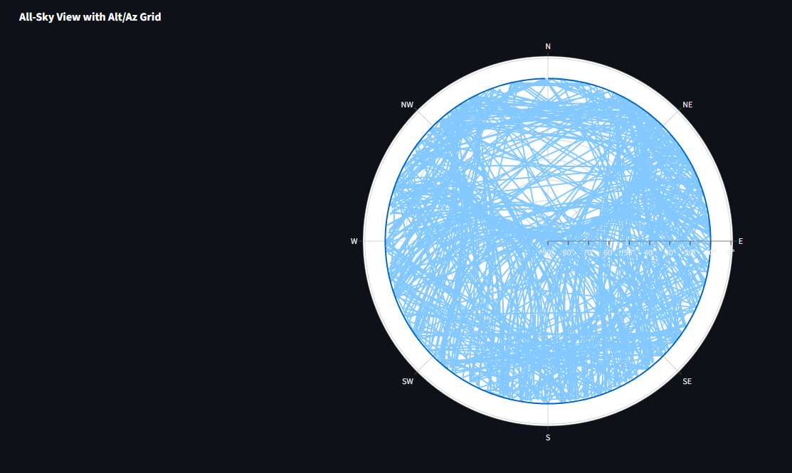
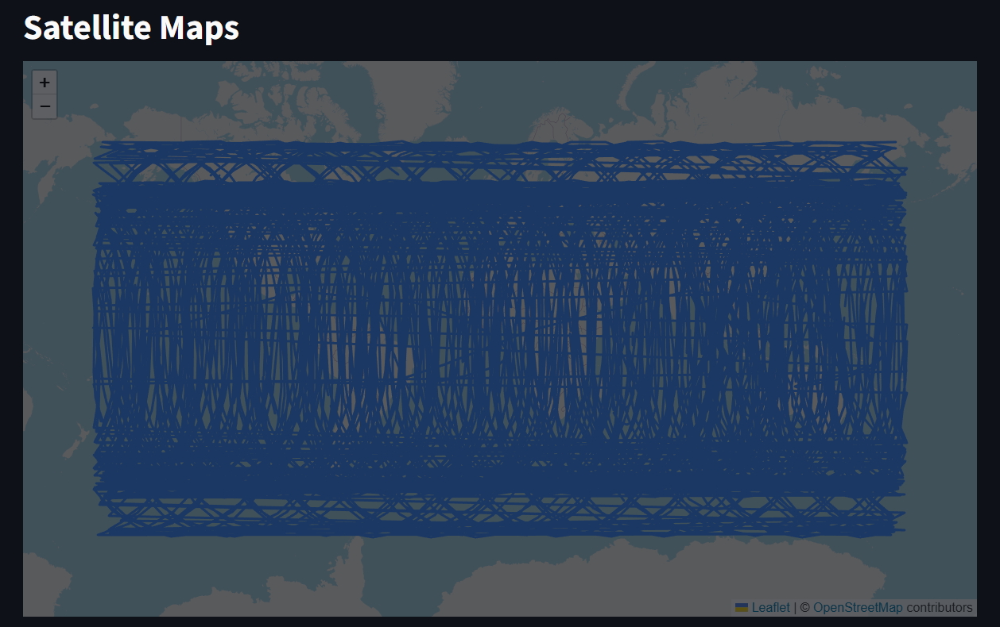

# GNSS Planner

Back in my day, we didn't have over a hundred GNSS satellites, we had Navstar GPS, and sometimes GLONASS. 
We also had to solve our differential correlation by hand, uphill, both ways... or something.

While not as important anymore due to the plethora of navigation satellites available, 
planning your data collection campaign around the number of satellites and diversity of location in the sky is important. 
Trimble made avaiable a Microsoft Silverlight application to help you plan, then they modernised and created their modern 
[Trimble GNSS Planning Website](https://www.gnssplanning.com/).
The main features include:

* Setting your collection location
* Choosing constellations and satellites for inclusion
* Showing time enabled graphs with counts and geometry of satellites in the sky
* Expected Dilution of Precision (DOP) values
* Ionospheric conditions

I figure, I can replicate many of these with my favorite Python libraries and self-host my own GNSS Planning Dashboard. 
This repository is exactly for that, and here I demonstrate the use of the following libraries in making this platform:

* Streamlit
* Folium and Streamlit-Folium
* Skyfield
* GeoPandas
* SQLAlchemy
* Requests
* Plotly

Future Features:

* Constellation and satellite include/exclude
* Caching satellite calculations
* Add collection sites to database to re-use and cache calculations ahead of access
* Improve location selection map
* Integrate [pytzwhere](https://github.com/pegler/pytzwhere) to automate timezone selection

Further future updates:

* DOP predictions
* Ionospheric data integration perhaps from [here](https://services.swpc.noaa.gov/products/glotec/geojson_2d_urt/)

## Installation

Clone the repository locally:

    git clone https://github.com/gspeed0689/gnss-planner.git

Change directory inside, and either 

    uv sync

or

    pip install -e .

Activate your virtual environment.
Change directory into `gnss-planner` and run

    streamlit run 00_🛰️_GNSS_Planner.py

## Usage

On the first page, select your location and time settings. 

Set the location by navigating to your area of interest where you will carry out fieldwork, and then press the `Update location` button.

On the Charts page you will find 3 graphs

The number of satellites visible over time

The altitude of satellites over time

The location of the satellite in the sky over time. 

On the Map page, see the satellites and their paths around the world. Avoid this page, it isn't working correctly

## Special Callouts

I was struggling with the polar skyplot and how to invert the graph, 
I stumbled upon the library I probably could have just re-used, SatChecker. 
This project has some example code on [their documentation page here](https://satchecker.readthedocs.io/en/latest/notebooks/overhead.html) 
on how to stylize their graph, thanks alot I reapplied your code. 

